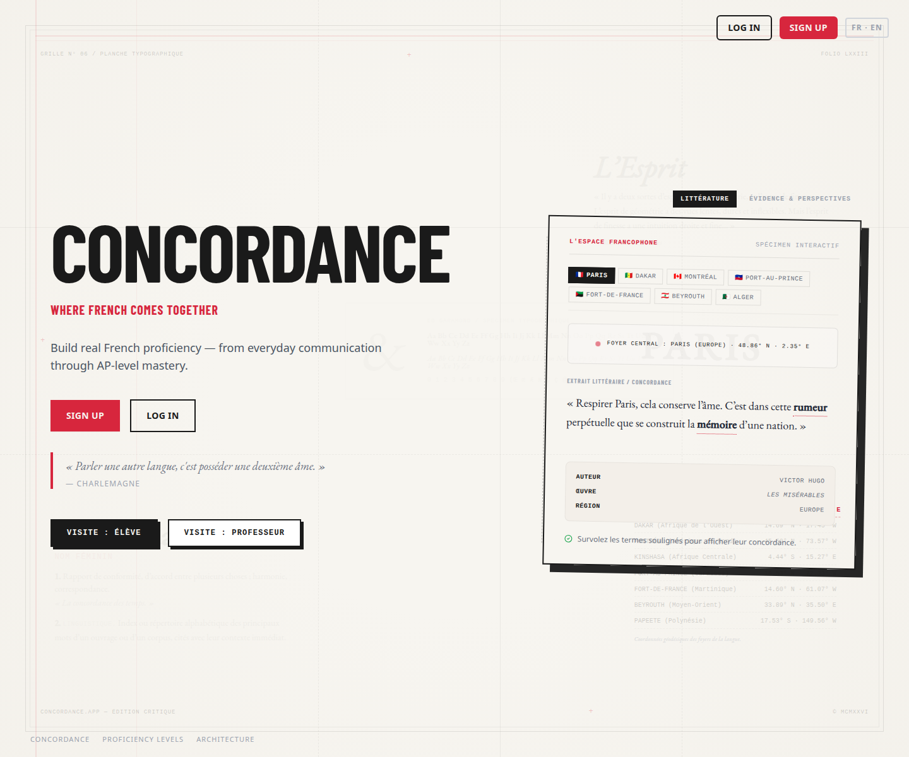

# Concordance Features — Visual Showcase

**[→ Explore Concordance](https://concordancelearn.com/)**

Concordance helps learners build real French proficiency through meaningful communication, targeted practice, and feedback that can be understood by learners and teachers.

The product already includes a substantial set of French-learning and teacher-support experiences. The deeper LAOS architecture is designed to connect those experiences to evidence-informed educational guidance over time. The accepted Recommendation Engine architecture is not yet a deployed runtime feature; its implementation is the next engineering phase.

## Product at a glance

The public landing page introduces Concordance's visual language and its emphasis on French as a living language.



The anonymous public tours provide a safe overview of the student and teacher experiences. They do not contain school data or authenticated account information.

All screenshots in this repository are public product views or synthetic demonstrations. They are not evidence of a particular learner's performance.

## Getting a demo link

Student-facing features are best explored through a **2-hour read-only demo session**. The demo requires no signup and saves no data. **[Request a demo link](https://concordancelearn.com/request-demo)** to receive a single-use link by email. See **[DEMO.md](DEMO.md)** for the walkthrough.

The demo is designed to show product behavior, not private learner records. Some first-login experiences, including Point de départ, may be skipped or pre-calibrated in the demo.

## For students

### Your learning plan and daily focus

The student experience is organized around a manageable next step rather than an endless catalog of activities. The home experience can bring together due review, focus areas, current proficiency context, and opportunities to practice.

The future Individual Learner Path will extend this direction by turning evidence-informed educational opportunities into choices. It is not intended to become a compulsory, machine-predicted route, and it is not presented here as a completed Recommendation Engine capability.

### Point de départ

Point de départ gives a new learner a short adaptive check-in before regular practice. It establishes a more useful starting position than an assumed zero or an unsupported self-rating.

Returning learners can see a brief daily practice preview. The experience is designed around steady progress and meaningful use, not a score or streak for its own sake.

### Evidence-informed practice

Concordance tracks patterns across graded work so practice can respond to demonstrated needs. Learners can see focus areas and explanations connected to concepts such as:

- verb conjugation and tense relationships;
- agreement, connectors, and pronoun use;
- thematic vocabulary and false friends;
- reading and listening comprehension; and
- communication choices that affect meaning.

The system provides estimates and guidance, not infallible judgments. Evidence can be incomplete, and teacher review remains important where a classroom context is available.

### Adaptive practice activities

Available practice includes:

- **Conjugaison** — verb conjugation with grammatical feedback;
- **Vocabulaire** — vocabulary in context with spaced review;
- **Compréhension** — reading and listening work with contextual support;
- **Connecteurs** — logical connectors and discourse markers;
- **Pronoms** — relative pronouns and object complements;
- **Concordance des temps** — sequence of tenses and subjunctive conditioning;
- **Sentence Builder** — sentence construction with distractors and explanations; and
- additional grammar and communication activities.

Activities can adjust to the learner's current context and responses. The goal is to make an incorrect answer useful by showing what it reveals and what could be practiced next.

### Speaking and pronunciation

Learners can practice speaking and pronunciation through:

- recorded speaking responses;
- conversation practice;
- pronunciation feedback;
- phoneme-level work through the IPA Pronunciation Wizard; and
- graded speaking tasks using conversation transcripts where available.

Speaking evidence is treated as distinct from transcription, provider output, and proficiency interpretation. Feedback is intended to support communication, not to reduce a learner to an automated score.

### Writing and exam-oriented practice

Writing tools support general French development and preparation contexts including AP French Language and Culture and AAPPL-oriented expression practice.

Learners can work with:

- generalized writing diagnostics;
- interactive proofreading and error explanations;
- presentational and interpersonal writing practice;
- AAPPL-oriented expression tasks; and
- AP-style prompts using text, infographic, and audio stimuli.

Feedback can address language control, organization, supporting evidence, and communicative effectiveness. Concordance is not an examination board or certification authority.

### Authentic language and culture

The Cultural Adventure Hub and related experiences place French in recognizable social and cultural contexts, including multiple Francophone regions. The Translanguaging Hub supports advanced work with literary, regional, historical, and cultural material.

These experiences are intended to expand learners' ability to interpret meaning, recognize register and context, and communicate thoughtfully across varieties of French.

### Portfolio and bilingual access

The portfolio brings together selected work and progress over time rather than presenting a single score as the whole learner record. The interface supports French and English so learners can use the platform while continuing to work toward meaningful French communication.

## For teachers

### Teacher Hub and Learner Evidence Profiles

The teacher experience is intended to make learner development understandable from evidence rather than from an opaque total score. Teacher views can include:

- class and learner progress patterns;
- instructional targets and estimated proficiency context;
- concept-level strengths, gaps, and uncertainty;
- provenance for work supporting a conclusion; and
- teacher observations, support, and contestation workflows.

Teachers retain professional judgment. Evidence informs what Concordance understands about learner performance; teachers help determine how that understanding should shape instruction.

### Class patterns and heatmaps

Teachers can inspect class-level patterns and drill into individual learners. Heatmaps, concept summaries, and trend views help identify where a group may need shared instruction and where an individual learner may need different support.

These views are intended to reduce manual sorting and calculation, not to make instructional decisions automatically.

### Targeted remediation and content support

When several learners show a similar need, teachers can use that evidence to create or select targeted practice. AI-assisted content generation can help draft reading passages, grammar explanations, vocabulary sets, and listening activities.

Teacher review remains part of the workflow. Generated content is not treated as educational authority simply because a model produced it.

### Class and school context

Teacher and school workflows can support roster management, class context, assignments, and classroom-specific priorities. The public product is intended to augment educators rather than replace them.

## Learning and content experiences

The platform connects several kinds of learning activity so that communication is not reduced to one exercise type:

- interpretive reading and listening;
- interpersonal conversation;
- presentational speaking and writing;
- grammar and vocabulary practice;
- pronunciation and fluency work;
- Francophone cultural scenarios; and
- AP French and AAPPL-oriented preparation contexts.

The longer-term Media Center direction may eventually connect educational targets with authentic audio, video, literature, and cultural material. Concrete media selection remains a downstream product capability, not a claim about the current Recommendation Engine.

## Administration and responsible review

Administrative and content workflows support the stewardship required by an educational product:

- human review of generated content before publication;
- human review of safety alerts, with no automatic punishment of learners;
- account and role management;
- privacy and data-lifecycle controls; and
- maintenance and operational safeguards.

These capabilities are important to responsible operation, but they are not the central educational story. Concordance's primary purpose remains helping learners communicate and helping teachers understand progress.

## What is implemented versus what comes next

### Available product experiences

The student practice, conversation, speaking, writing, listening, cultural, portfolio, teacher analytics, content-support, and administrative workflows described above represent the current public product surface, subject to account role and rollout availability.

### Architecture accepted

The LAOS foundation now provides an accepted architectural path from:

```text
Learner performance
→ evidence
→ learner understanding
→ framework interpretation
→ future instructional guidance
```

This design supports provenance, reproducibility, bounded AI authority, teacher oversight, and framework neutrality. It does not mean the Recommendation Engine runtime is already operating in production.

### In development or future direction

- Recommendation Engine runtime implementation;
- Individual Learner Path experiences;
- richer Teacher Workspace capabilities;
- Media Center and authentic-media connections;
- Language Specialist Workspace for living language and pedagogical definitions;
- governed research infrastructure; and
- possible language expansion and community-governed language preservation partnerships.

These directions are not promises of dates, complete framework coverage, official endorsement, or current implementation.

## Frameworks and independence

Concordance uses ACTFL, CEFR, AP, and AAPPL terminology to explain preparation and interpretation contexts. Frameworks are projections and reference points, not identities or substitutes for the underlying learner record.

Concordance is an independent project and is not affiliated with, sponsored by, or endorsed by ACTFL, Language Testing International, the Council of Europe, or the College Board. Only qualified educators or official testing organizations can determine the official status of a proficiency assessment or certification.

## Privacy and compliance

Concordance is designed around educational privacy, data minimization, human review, learner isolation, and teacher or administrator control over student records. Student data is not used for advertising.

See the **[Security & Privacy Policy](SECURITY.md)** for the project's published data-protection posture.

## Recommended exploration path

For a two-hour demo, explore:

1. **Practice** — try several activity types and read the explanations;
2. **Conversation Partner** — have a short French dialogue;
3. **Cultural Scenarios** — explore a Francophone context;
4. **Speaking or Writing** — submit a short response and review feedback;
5. **Focus Areas** — inspect how recurring needs are presented; and
6. **Portfolio** — review the learner's progress view.

## Support the project

Concordance is built and maintained by a practicing teacher. Sponsorship helps cover infrastructure, carefully controlled AI usage, accessibility, privacy, and the time required to move from foundational architecture to dependable learner-facing experiences.

**[Sponsor Concordance on GitHub →](https://github.com/sponsors/monsieur-trenton)**

See **[ROADMAP.md](ROADMAP.md)** for current priorities and what sponsorship funds next.
